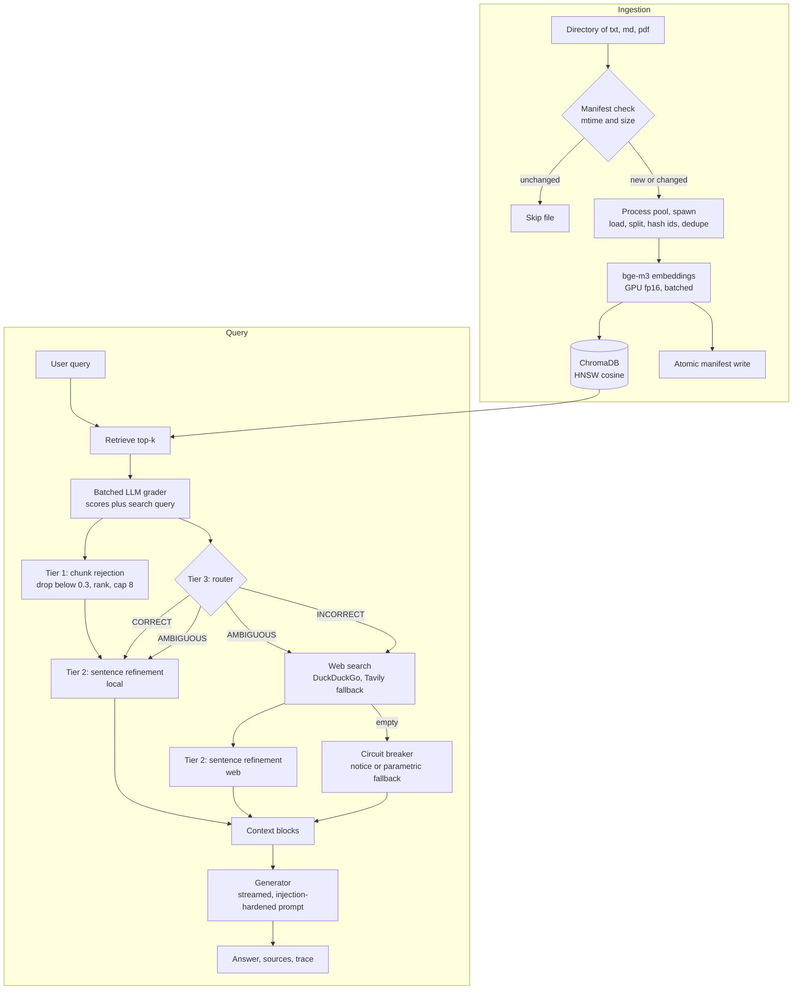

# modern-crag

A locally hosted, LangChain-based Retrieval-Augmented Generation system that replaces single-shot retrieval with an evaluation-driven control loop. Every retrieved chunk is graded by an LLM, weak context is rejected at three tiers, and knowledge gaps trigger query rewriting and live web search. Retrieval, grading, refinement and generation run locally through Ollama on consumer hardware (laptop CPU and a 6 GB GPU). Only the web fallback leaves the machine.

Built on: LangChain, Ollama, BAAI/bge-m3, ChromaDB (HNSW), DuckDuckGo and Tavily.

The design follows Corrective RAG (Yan et al., 2024, arXiv:2401.15884) and replaces several of its components with choices suited to a single-GPU machine and a large personal PDF corpus.

Note on claims: no retrieval or answer-quality benchmark has been run. Comparisons below are structural. Timing figures in section 8 are single-run measurements on one machine.

---

## Table of Contents

1. [Approach](#1-approach)
2. [Architecture](#2-architecture)
3. [Pipeline Stages](#3-pipeline-stages)
4. [Data Flow](#4-data-flow)
5. [Comparative Analysis](#5-comparative-analysis)
6. [New Approaches](#6-new-approaches)
7. [Hurdles and Fixes](#7-hurdles-and-fixes)
8. [Performance Characteristics](#8-performance-characteristics)
9. [Known Limitations and Future Work](#9-known-limitations-and-future-work)
10. [Requirements](#10-requirements)
11. [Setup](#11-setup)
12. [Usage](#12-usage)
13. [Configuration Reference](#13-configuration-reference)
14. [Project Structure](#14-project-structure)
15. [Troubleshooting Quick Reference](#15-troubleshooting-quick-reference)
16. [Acknowledgements and Reference](#16-acknowledgements-and-reference)

---

## 1. Approach

Classical RAG is fire-and-forget: embed documents, retrieve top-k chunks, place them in a prompt, generate. It has no notion of whether the retrieved context answers the question. When retrieval fails, the generator either hallucinates or refuses, and the user cannot tell which happened.

This project treats retrieval as fallible and wraps it in an explicit control loop.

Design principles:

1. **Evaluate before generating.** An LLM evaluator scores every retrieved chunk on a 0.0 to 1.0 relevance scale before any context reaches the generator.
2. **Reject progressively.** Irrelevant material is discarded at three granularities: chunk level (score gate, ranking, cap), sentence level (refinement), and source level (verdict routing).
3. **Degrade explicitly.** Fallbacks announce themselves. Unparseable evaluator output prints a snippet of what the model returned. A failed web search produces a provenance notice in the answer. Total retrieval failure forces the generator to label its answer as unverified general knowledge.

Pipeline summary:

1. Retrieve candidate chunks from the local vector store.
2. Grade every candidate against the question with a local LLM.
3. Drop weak chunks, then route on the grades.
4. Refine surviving knowledge at sentence level.
5. For AMBIGUOUS and INCORRECT verdicts, rewrite the question into a keyword query and search the web.
6. Generate a grounded answer from the refined context only.
7. If local and web retrieval both fail, say so and label the answer as unverified.

Routing rule:

| Condition on chunk scores | Verdict | Knowledge used |
|---|---|---|
| max(score) >= 0.7 | CORRECT | Refined local chunks |
| all scores < 0.3 | INCORRECT | Web results only |
| otherwise | AMBIGUOUS | Refined local chunks plus web results |

---

## 2. Architecture



Four modules, one responsibility each:

| File | Responsibility | Key components |
|---|---|---|
| `retrieval.py` | Ingestion and vector search | PyMuPDF and TextLoader, RecursiveCharacterTextSplitter (800/150), SentenceTransformer bge-m3 (fp16, GPU), ChromaDB persistent HNSW (cosine), incremental sync manifest, process-pool parsing |
| `evaluator_router.py` | Evaluation, routing, refinement, fallback | LLM chunk grader (0.0 to 1.0), threshold router, sentence-level refiner, query rewriter, DuckDuckGo and Tavily search chain |
| `generator.py` | Grounded synthesis | Hardened system prompt, context and question delimiters, token-streamed generation, source formatting |
| `main.py` | Orchestration and CLI | Pipeline control flow, chunk selection, circuit breakers, interactive loop, startup menu |

---

## 3. Pipeline Stages

### 3.1 Ingestion (`retrieval.py`)

- Discovers `.txt`, `.md`, `.pdf` recursively.
- Compares each file's `mtime` and `size` with `manifest.json`. Unchanged files are skipped. Deleted files have their vectors removed.
- Workers run in a `ProcessPoolExecutor` with the `spawn` context. Each worker loads the file (`PyMuPDFLoader` for PDF, `TextLoader` with `chardet` for text), splits it with `RecursiveCharacterTextSplitter` (800 characters, 150 overlap), and builds MD5 chunk ids with in-file deduplication.
- The main process embeds chunks with `BAAI/bge-m3` (normalized, batch 64, fp16 on CUDA) and writes to Chroma in batches of 500.
- The manifest is written atomically (`manifest.json.tmp`, then `os.replace`) after each file, so an interrupt keeps all completed work.
- A failed embedding write rolls back the ids already written for that file.

### 3.2 Retrieval

`similarity_search_with_score` on a Chroma collection with HNSW parameters `M=16`, `construction_ef=200`, `search_ef=64` (configurable), cosine space. Default `k=8`.

### 3.3 Grading (`evaluator_router.py`)

- One listwise call grades up to 12 chunks, each truncated to 600 characters.
- The model returns strict JSON with a score per chunk and a keyword `search_query` for the web, in the same response.
- Bands: 0.7 to 1.0 answers the question, 0.3 to 0.69 is partial background, below 0.3 is noise.
- Temperature 0.0, thinking disabled.

Failure handling, in order:

1. JSON-mode call, parsed by a tolerant extractor that strips markdown fences and surrounding prose.
2. If unparseable, a second text-mode call asking for comma-separated scores, parsed with regex.
3. If that also fails, neutral 0.5 scores for all chunks. This forces an AMBIGUOUS verdict and therefore a web search.

### 3.4 Tier 1 rejection and routing

Chunks scoring below 0.3 are dropped. The remainder is sorted by score and capped at 8. `route_verdict` then applies the table in section 1.

### 3.5 Tier 2 refinement

- Selected chunks are split into sentences, capped at 50.
- The model returns the ids of sentences worth keeping, JSON first, then a comma-separated text fallback.
- If both passes fail, all sentences are kept. If the model returns an empty list, that source contributes nothing.
- This strips the side information that chunk overlap drags in.

### 3.6 Web fallback

- The query comes from the grader's `search_query`. If absent, a dedicated rewrite call produces one.
- DuckDuckGo is tried twice with an 8 second timeout. If it returns nothing, Tavily is tried when `TAVILY_API_KEY` is set.
- Result titles and snippets go through the same sentence refinement. If refinement removes everything, unfiltered snippets are used and labeled as such.

### 3.7 Circuit breakers

If web search returns nothing:

- With refined local context available (AMBIGUOUS route), a notice states that the web was unavailable and the local content was only partly relevant.
- With no context at all, the generator is switched to PARAMETRIC FALLBACK and must state that the answer is unverified general knowledge.

### 3.8 Generation (`generator.py`)

- Streams tokens from a local Ollama model.
- Context and question are wrapped in `<<<CONTEXT_BEGIN>>>` and `<<<QUESTION_BEGIN>>>` delimiters.
- The system prompt treats everything inside the delimiters as untrusted data, forbids persona switching and configuration disclosure, and forbids fabricated source names.

---

## 4. Data Flow

### 4.1 Query path

```
query
  -> embed query (bge-m3)
  -> Chroma top-k (cosine)                          list[chunk]
  -> grader (1 LLM call)                            scores[], search_query
  -> tier 1: keep >= 0.3, sort desc, cap 8          selected_chunks
  -> route_verdict(scores)                          CORRECT | AMBIGUOUS | INCORRECT
  -> if CORRECT or AMBIGUOUS:
        tier 2: refine(selected_chunks)             local_refined
  -> if AMBIGUOUS or INCORRECT:
        web_search(search_query)                    results[]
        tier 2: refine(results)                     web_refined
  -> assemble context_blocks, sources, notice
  -> generator.stream(query, context_blocks)        tokens
  -> print sources and elapsed time
```

Context layout passed to the generator:

```
[SOURCE 1: local documents]
<refined local sentences>

[SOURCE 2: live web results]
<refined web sentences>
```

A "context block" is an assembled unit (refined local text, refined web text, or a system notice). It is not a retrieved chunk. The trace line `generating answer from N context block(s)` counts these.

LLM calls per query: 1 grading call, up to 2 refinement calls (local and web), 0 or 1 rewrite call, 1 generation call. Each control call retries in text mode on a parse failure.

### 4.2 Ingestion path

```
directory scan (.txt .md .pdf, recursive)
        |
        v
manifest check (mtime + size per file) ---> unchanged: skip, no re-embedding
        |
        v
PROCESS POOL (spawn, x4):            MAIN PROCESS (serial):
  PyMuPDF / TextLoader parse           delete previous ids for the file
  recursive split (800/150)            GPU fp16 batch-64 embedding
  md5 chunk ids                        Chroma writes (batches of 500)
  per-file chunk dedup                 rollback on failed write
                                       manifest checkpoint after every file
```

Parsing is CPU-bound and GIL-hostile, embedding is GPU-bound, so they overlap. The main process embeds one file while workers parse the next, with a bounded in-flight window of `2 x workers` files to cap memory.

Chunk ids are `md5(abspath::chunk_text)`. Writes delete a file's previous ids first, so re-runs and re-ingests do not duplicate vectors. Interrupted runs lose at most the file in progress.

---

## 5. Comparative Analysis

### 5.1 Against naive RAG

| Dimension | Naive RAG | This pipeline |
|---|---|---|
| Retrieval | Single shot, top-k, unconditional | Top-k, then LLM evaluation of every chunk |
| Trust in retrieval | Assumed correct | Assumed fallible, verified per chunk |
| Context construction | All k chunks forwarded | Three tiers: chunk (score gate, ranking, cap), sentence (filter and recompose), source (verdict routing) |
| Failure handling | Hallucination or silent refusal | Routing to query rewrite and web fallback, circuit breakers, labeled parametric mode |
| Query transformation | None, raw user query | Keyword rewrite fused into the grading call |
| External knowledge | None | DuckDuckGo chain with optional Tavily fallback |
| Ingestion | Batch script, full re-run | Incremental manifest, deleted-file pruning, per-file checkpoints, partial-write rollback |
| Ingestion parallelism | Sequential | Process-pool parsing overlapped with GPU embedding |
| Observability | None | Trace of per-chunk scores, kept and dropped counts, verdict, rewritten query, result counts, timing |
| Output discipline | Prompt-dependent | Delimited context, grounding rules, no fabricated source names |
| Security | None | Untrusted-data framing at every LLM boundary, persona lock (prompt level) |
| GPU handling | Default placement | fp16 embeddings, configurable batch size, CPU fallback |

Structurally, the change is from a linear pipeline to a feedback control loop. The evaluator sits between retrieval and generation, its output drives branching, and the loop closes through the web fallback that repairs gaps the local store cannot cover.

### 5.2 Against the original CRAG design

The left column summarizes Yan et al. (2024). Verify details against the paper.

| Component | Original CRAG | This implementation |
|---|---|---|
| Retrieval evaluator | Fine-tuned lightweight T5-based scorer on query-document pairs | Zero-shot local LLM (`gemma4:e4b` by default) through Ollama, no fine-tuning |
| Grading call shape | Independent pair scoring | One listwise call over all candidates |
| Evaluator output | One confidence score per document | Per-chunk scores plus a keyword web query in one response |
| Evaluator robustness | Not a concern with a fine-tuned scorer | Three transport tiers, JSON then text-mode parsing, neutral 0.5 as last resort |
| Thresholds and actions | Upper and lower thresholds, three actions | Same three actions. Constants 0.7 and 0.3, max-based CORRECT, all-below-lower INCORRECT |
| Knowledge refinement | Decompose into strips, score strips, recompose | Sentence split, LLM returns ids to keep, JSON then text fallback, keep-all on total failure |
| Chunk-level gate | Not described as a separate step, as far as I know | Explicit drop below 0.3, rank, cap, before refinement |
| Query rewriting | Separate rewrite step before web search | Folded into grader output, standalone rewrite kept as fallback |
| Web search | Commercial search API | DuckDuckGo first, optional Tavily, retry with timeout, no key required |
| Total failure behavior | Not specified | Circuit breaker, user-facing notice, labeled parametric fallback |
| Knowledge base | Fixed corpus | Incremental ingestion, process-pool parsing, atomic checkpoints, rollback |
| Hardware target | Research setup | Single consumer GPU, fp16 embeddings, local generator, bounded context |
| Generator safety | Not addressed | Delimited untrusted-input prompt, anti-injection and anti-disclosure rules |

Consequence of replacing a fine-tuned T5 evaluator with a prompted LLM: no training data is needed and the evaluator is flexible, but its output format is non-deterministic and its scores are uncalibrated. Most of the parsing and fallback machinery in `evaluator_router.py` exists because of that trade.

---

## 6. New Approaches

Beyond the standard CRAG formulation (evaluator, thresholds, decompose-filter-recompose, web fallback), this implementation adds:

1. **Fused evaluator and rewriter.** The grading call also emits the web query. On fallback routes this removes one LLM round trip. The standalone rewriter remains as a fallback.
2. **A chunk-level rejection tier before refinement.** Whole chunks below 0.3 are discarded and the rest are re-ranked, so the sentence refiner only processes chunks that already earned their place.
3. **Listwise grading.** The model sees all candidates in one prompt and scores them relative to each other.
4. **Dual-protocol structured output with degradation.** Control calls use the raw Ollama chat API with `think=False`, retry without `think`, then fall back to LangChain `ChatOllama`. If JSON still fails to parse, a text-mode re-prompt asks for comma-separated values. The last resort is a neutral score that routes to more evidence, not less.
5. **Id-based sentence selection.** The refiner returns integers, not rewritten text, so it cannot alter or invent source sentences.
6. **Explicit failure signaling.** Parse failures print a snippet of the raw model output, and the neutral-score fallback prints a message. This was a real failure mode: a broken grader defaulted every chunk to 0.5, which forced the AMBIGUOUS route on every query.
7. **Distinct circuit-breaker notices.** A web outage with usable local context and a total retrieval failure produce different, explicit messages.
8. **Interrupt-safe incremental ingestion.** `(mtime, size)` change detection, deletion tracking, per-file atomic checkpoints, partial-write rollback.
9. **Pipelined parallel ingestion with bounded memory.** Spawn-context process pool overlapped with serial GPU embedding, windowed at `2 x workers` files in flight.
10. **Adaptive embedding loader.** Prefers fp16 on CUDA, falls back to fp32 and CPU, tries local-only weights before network access, and converts the torch CVE-2025-32434 load error into an actionable message.
11. **Prompt-injection-aware generation.** Delimited context, untrusted-data framing in every control prompt, persona and disclosure locks.
12. **Terminal UX for a local pipeline.** Dual `rich` progress bars (files and per-chunk embedding) with a plain-text renderer for non-TTY output, and token-streamed answers.

---

## 7. Hurdles and Fixes

Each item is written as symptom, root cause, resolution.

### 7.1 Ingestion took 40 to 50 minutes for 2 PDFs

- **Symptom:** More than 20 minutes per PDF.
- **Root cause:** `PyPDFLoader` uses pure-Python `pypdf`, runs sequentially under the GIL, and embeddings ran on CPU.
- **Resolution:** Switched to `PyMuPDFLoader` (C-based MuPDF), moved from threads to `ProcessPoolExecutor` (`pool_kind="process"`), and enabled CUDA fp16 batched embeddings.

### 7.2 `Torch not compiled with CUDA enabled`

- **Symptom:** Fatal error on engine start, or embeddings silently running on CPU with no GPU utilization.
- **Root cause:** Default `pip install torch` on Windows installs a CPU-only wheel, and a plain version specifier accepts `+cpu` builds, so a CPU torch satisfied the requirement.
- **Resolution:** Pinned `torch==2.6.0+cu124` through the PyTorch CUDA 12.4 index. The local-version pin makes the requirements file reject CPU wheels. The loader also checks `torch.cuda.is_available()` and falls back to CPU.

### 7.3 `torch.load` refusal (CVE-2025-32434)

- **Symptom:** Startup error. Transformers refuses to load `pytorch_model.bin` weights on torch below 2.6.
- **Root cause:** bge-m3 ships `.bin` weights and older torch blocks `torch.load` on them because of the vulnerability.
- **Resolution:** torch 2.6 or newer, plus a specific error message at model load that names the fix.

### 7.4 Unexpected Hugging Face network calls

- **Symptom:** Unauthenticated-request warnings despite a locally cached model.
- **Root cause:** Hugging Face sends a HEAD request on load to validate the cache.
- **Resolution:** The loader tries `local_files_only=True` first. It goes online only if the local load fails.

### 7.5 Telemetry errors and log flooding

- **Symptom:** Repeated `Failed to send telemetry event ... capture() takes 1 positional argument`, and a flood of `Delete of nonexisting embedding ID` warnings burying the progress UI.
- **Root cause:** A `posthog` 3.x signature change against `chromadb` 0.5.x, plus per-id warnings from the pre-delete that makes ingestion idempotent.
- **Resolution:** `posthog<3` pin, `anonymized_telemetry=False` through both environment and client settings, and the `chromadb` logger clamped to ERROR.

### 7.6 `Expected IDs to be unique, found duplicates ... in upsert`

- **Symptom:** Chroma batch write failed on a multi-page PDF.
- **Root cause:** Chunk ids are MD5 of `path::text`. Repeated headers, footers, licenses, slide templates and blank regions produce identical chunk text within one file, so ids collided inside a batch.
- **Resolution:** A per-file `seen_ids` set in the worker drops duplicate chunks before they reach the store, so every id in a batch is unique.

### 7.7 Evaluator scores stuck at 0.50 and a frozen AMBIGUOUS verdict

- **Symptom:** Trace showed `chunk scores: 0.50, 0.50, 0.50, 0.50` and verdict AMBIGUOUS on every query, which looked hardcoded. The plain-text rewriter worked while grading failed.
- **Root cause:** The model emitted markdown fences or reasoning text around the JSON, and reasoning tokens produced by default conflicted with JSON-mode output. The strict parser failed and the neutral fallback fired, swallowing the failure. Separately, "2 context blocks" in the trace had been read as 2 retrieved documents. It counts assembled blocks, not chunks.
- **Resolution:** Tolerant JSON extraction with fence stripping, a second text-mode scoring pass, `think=False`, bounded `num_predict`, diagnostics that print the raw response, and retrieval depth raised from 4 to 8 or more through `--k`.

### 7.8 Incremental sync appeared to re-chunk all 101 files

- **Symptom:** After adding 2 files to a folder of 99 PDFs, progress jumped to 99/101 almost immediately.
- **Root cause:** Not a defect. Unchanged files are checked by `(mtime, size)` and skipped, which took about 22 seconds in total. The counter advances for skipped files too, which looks like reprocessing.
- **Resolution:** Verified through the manifest that only the 2 new files were extracted and embedded. Skipped files are labeled `unchanged:` in the progress description.

### 7.9 Context truncation at Ollama's default window

- **Symptom:** Large context blocks were truncated during grading and generation.
- **Root cause:** Ollama's default context window is small relative to 12 graded chunks or a 50-sentence refinement prompt.
- **Resolution:** `num_ctx=8192` on every Ollama call path, plus explicit limits `MAX_GRADE_DOCUMENTS=12`, `MAX_GRADE_CHARS=600`, `MAX_REFINE_SENTENCES=50` to keep prompts inside the window.

### 7.10 End-to-end latency of 196 seconds on a 6 GB GPU

Contributors identified during development:

- Hidden reasoning tokens on every control call.
- Probable VRAM contention between the embedding model (about 1.2 GB in fp16) and the 4B LLM, forcing layers to CPU. This was inferred, not measured with a profiler.
- Four sequential LLM round trips on fallback routes.
- A failing web search consuming its full timeout.

Resolution: reasoning disabled on control calls, tightened `num_predict` and `num_ctx`, the fused grader and rewriter call (one fewer round trip), `keep_alive=30m` to pin the model, fp16 embeddings with a tunable batch size, and streamed generation so output appears immediately.

### 7.11 DuckDuckGo blocked at network level

- **Symptom:** Zero web results on every query, not only during rate-limit spikes.
- **Resolution:** A provider chain (DuckDuckGo, then optional keyed Tavily), a one-time hint explaining the likely cause and fix, and the circuit-breaker notices in section 3.7.

### 7.12 Windows-specific correctness

- ANSI escapes enabled explicitly for terminal control.
- Process pool forced to `spawn`, which avoids inheriting forked CUDA state and is the only start method on Windows.
- Filenames containing `[` and `]` sanitized before reaching `rich`'s markup parser.
- Quoted and `~`-expanded directory paths handled.

### 7.13 Lost progress on interrupt

- **Symptom:** A Ctrl+C mid-ingest previously lost all manifest progress and forced full re-embedding.
- **Resolution:** Per-file manifest checkpoints with atomic replace, id-addressed writes, and partial-write rollback. An interrupt now costs at most the file in progress.

---

## 8. Performance Characteristics

Measured by the author on the development machine (i5-13420H, RTX 4050 6 GB, 16 GB RAM, Windows 11). These are single runs, not averaged benchmarks.

| Measurement | Result |
|---|---|
| Ingestion, PDF-heavy corpus | 42 files, 38,788 chunks, about 14.5 minutes wall clock (process pool x4, fp16 GPU embedding, batch 64), roughly 45 chunks per second sustained |
| Ingestion, small corpus | 1,624 chunks in about 54 seconds |
| Query latency, AMBIGUOUS route with failed web search, before control-call optimizations | 85.9 seconds |
| Query latency, worst observed before optimizations | 196 seconds |
| Query latency after optimizations | Not recorded |

Latency is dominated by local LLM inference. CORRECT-route queries make fewer calls than AMBIGUOUS or INCORRECT ones (no web search, no web refinement). Control calls run at temperature 0 with capped output length, and generation streams token by token.

Index: HNSW, cosine space, `M=16`, `construction_ef=200`, default `search_ef=64`.

---

## 9. Known Limitations and Future Work

Limitations:

- **No evaluation harness.** No labeled query set, no recall or faithfulness measurement. Thresholds 0.7 and 0.3 are empirical defaults.
- **Uncalibrated LLM scores.** A prompted model's 0.0 to 1.0 output is not a probability, and distributions shift with model and prompt.
- **Refinement truncation.** Only the first 50 sentences are considered. Later sentences are dropped by position, not relevance.
- **Grading truncation.** Each chunk is cut to 600 characters for grading, so a relevant passage late in an 800-character chunk can be underscored.
- **Single model by default.** Grading, refinement, rewriting and generation share one model unless `CRAG_CONTROL_MODEL` is set. Self-agreement bias is possible.
- **Snippet-level web evidence.** Results contribute titles and snippets, not fetched pages.
- **Prompt-level injection defense.** No output filter or classifier backs the system prompt and delimiters.
- **High generator temperature.** The generator uses `temperature=0.9`, which is high for grounded answering and raises paraphrase drift risk.
- **Partly silent exception paths.** Parse failures print diagnostics, but some exceptions are swallowed without a trace: the grading exception handler in `main.py`, DuckDuckGo errors, and transport errors inside `_control_complete`.
- **Content-hashed ids.** Editing a file regenerates all of its ids. Handled by delete-then-insert per file, with cost proportional to file size.

Future work:

- Add a labeled evaluation set and report retrieval precision and answer faithfulness per verdict. Calibrate the thresholds against it, or optimize thresholds and control prompts with DSPy or TextGrad instead of hand tuning.
- Parallelize grader and refiner calls on GPUs with headroom (Ollama executes serially by default).
- Insert a small cross-encoder reranker between retrieval and grading.
- Fetch and clean full web pages instead of using snippets.
- Lower the generator temperature and test the effect on faithfulness.
- Migrate the vector store from ChromaDB to Milvus. The `VectorEngine` boundary is narrow, so a backend swap through the LangChain vector store interface is localized.

---

## 10. Requirements

### Hardware (developed and run on)

- Windows 11
- Intel i5-13420H, 16 GB RAM
- NVIDIA RTX 4050 Laptop GPU, 6 GB VRAM

CPU-only operation works through automatic fallback and is much slower for ingestion.

### Software

- Python 3.10 to 3.12
- Conda
- Ollama, running locally
- NVIDIA driver compatible with CUDA 12.4 for GPU embeddings

### Python packages

Defined in `requirements.txt`. Key pins:

| Package | Constraint | Reason |
|---|---|---|
| `torch` | `==2.6.0+cu124` | CUDA build. Versions below 2.6 refuse to load bge-m3 `.bin` weights (CVE-2025-32434) |
| `numpy` | `>=1.26.4,<2.0` | Compatibility with the pinned stack |
| `sentence-transformers` | `>=3.3,<6` | bge-m3 loading and encoding |
| `langchain`, `langchain-core`, `langchain-community`, `langchain-text-splitters` | `0.3.x` | Loaders and splitter |
| `langchain-chroma`, `chromadb` | `>=0.2,<0.3`, `>=0.5.18,<0.6` | Vector store |
| `langchain-ollama` | `>=0.2,<0.4` | Ollama chat client |
| `pymupdf` | `>=1.24,<2` | Fast PDF parsing |
| `duckduckgo-search` | `>=6.3,<7` | Primary web search |
| `posthog` | `>=2.4,<3` | Avoids the telemetry signature break with chromadb 0.5.x |
| `rich`, `chardet` | see file | Progress bars, encoding detection |

Optional: `tavily-python` for the Tavily fallback. `ddgs` is used automatically if `duckduckgo-search` is missing.

### Models

| Role | Model | Source |
|---|---|---|
| Embeddings | `BAAI/bge-m3` | Hugging Face, downloaded on first run |
| Grader, refiner, rewriter, generator | `gemma4:e4b` | `ollama pull gemma4:e4b` |

Any Ollama chat model works. Set the tag through `CRAG_MODEL`. A smaller model for control calls through `CRAG_CONTROL_MODEL` reduces query latency.

---

## 11. Setup

### 11.1 Clone

```bash
git clone https://github.com/<your-username>/<your-repo>.git
cd <your-repo>
```

### 11.2 Create the environment

```bash
conda create -n crag python=3.11 -y
conda activate crag
pip install -r requirements.txt
```

The requirements file already contains the PyTorch CUDA 12.4 index.

### 11.3 Verify CUDA

```bash
python -c "import torch; print(torch.__version__, torch.cuda.is_available())"
```

Expected output: `2.6.0+cu124 True`. If it prints `False`, see [Troubleshooting](#15-troubleshooting-quick-reference).

### 11.4 Install and start Ollama

Install Ollama from https://ollama.com, then:

```bash
ollama pull gemma4:e4b
ollama list
```

### 11.5 Optional web fallback key

```bash
pip install tavily-python
set TAVILY_API_KEY=your_key
```

On Linux or macOS use `export TAVILY_API_KEY=your_key`.

### 11.6 Add documents

Place `.txt`, `.md` and `.pdf` files in any folder. Subfolders are scanned recursively.

---

## 12. Usage

First run with ingestion:

```bash
python main.py --ingest-dir "path/to/docs"
```

Interactive menu:

```bash
python main.py
```

Menu options: (1) chunk a directory, (2) continue with the existing store, (3) incremental sync of the last directory.

Sync only new or changed files from the last ingested directory:

```bash
python main.py --sync
```

Skip the menu and use the existing store:

```bash
python main.py --no-menu
```

Wipe the store and manifest, then re-ingest:

```bash
python main.py --reset --ingest-dir "path/to/docs"
```

Deeper retrieval with higher recall, quiet output:

```bash
python main.py --no-menu --k 10 --ef 128 --quiet
```

### CLI flags

| Flag | Default | Meaning |
|---|---|---|
| `--ingest-dir DIR` | none | Chunk a directory before chatting |
| `--sync` | off | Chunk only new or changed files from the last directory |
| `--k N` | 8 | Chunks retrieved and graded per query |
| `--ef N` | `CRAG_SEARCH_EF` | HNSW search depth (16 to 32 fast, 128 to 256 high recall) |
| `--reset` | off | Delete the Chroma store and manifest |
| `--quiet` | off | Hide pipeline trace and source footer |
| `--no-menu` | off | Skip the startup menu |

### In-chat commands

| Command | Action |
|---|---|
| `/menu` | Ingestion options |
| `/stats` | Chunk count and last directory |
| `exit`, `quit`, `bye` | Leave |

### Example trace

```
[crag] retrieved 8 local chunk(s) for grading
[crag] chunk scores: 0.90, 0.80, 0.30, 0.10, 0.10, 0.00, 0.00, 0.00
[crag] chunk selection: kept 3/8 (dropped 5 below 0.3)
[crag] routing verdict: CORRECT
[crag] generating answer from 1 context block(s)
```

---

## 13. Configuration Reference

### Environment variables

| Variable | Default | Effect |
|---|---|---|
| `OLLAMA_HOST` | `http://localhost:11434` | Ollama endpoint |
| `CRAG_MODEL` | `gemma4:e4b` | Generator model, and evaluator model unless overridden |
| `CRAG_CONTROL_MODEL` | falls back to `CRAG_MODEL` | Separate model for grading, refinement and rewriting |
| `CRAG_SEARCH_EF` | `64` | HNSW search depth |
| `CRAG_EMBED_BATCH` | `64` | Embedding batch size, minimum 8. Lower to 32 if VRAM is tight |
| `CRAG_EMBED_DEVICE` | auto | Force `cuda` or `cpu` |
| `TAVILY_API_KEY` | unset | Enables the Tavily fallback |

### Constants in code

| Constant | File | Value |
|---|---|---|
| `UPPER_THRESHOLD` | `evaluator_router.py` | 0.7 |
| `LOWER_THRESHOLD` | `evaluator_router.py` | 0.3 |
| `MAX_CONTEXT_CHUNKS` | `evaluator_router.py` | 8 |
| `MAX_GRADE_DOCUMENTS` | `evaluator_router.py` | 12 |
| `MAX_GRADE_CHARS` | `evaluator_router.py` | 600 |
| `MAX_REFINE_SENTENCES` | `evaluator_router.py` | 50 |
| `WEB_RESULT_LIMIT` | `evaluator_router.py` | 4 |
| `SEARCH_TIMEOUT_SECONDS` | `evaluator_router.py` | 8 |
| `CHUNK_SIZE`, `CHUNK_OVERLAP` | `retrieval.py` | 800, 150 |
| `WRITE_BATCH_SIZE` | `retrieval.py` | 500 |

Separate control and generation models:

```bash
set CRAG_CONTROL_MODEL=gemma4:e4b
set CRAG_MODEL=your-larger-model
```

---

## 14. Project Structure

```
.
├── main.py                 orchestration, CLI, pipeline control flow
├── retrieval.py            ingestion, embedding, vector store, parallel pipeline
├── evaluator_router.py     grading, routing, refinement, rewriting, web search
├── generator.py            grounded generation, prompt hardening, streaming
├── requirements.txt        pinned, GPU-explicit dependency set
├── README.md
├── .gitignore
└── crag_vector_store/      created at runtime, git-ignored
    ├── manifest.json
    └── chroma files
```

---

## 15. Troubleshooting Quick Reference

| Error or symptom | Cause | Fix |
|---|---|---|
| `Torch not compiled with CUDA enabled` | CPU-only torch wheel | `pip uninstall torch`, then `pip install -r requirements.txt` to get `2.6.0+cu124` |
| `torch.cuda.is_available()` is `False` with a CUDA wheel | Driver too old or no NVIDIA GPU | Update the NVIDIA driver. Set `CRAG_EMBED_DEVICE=cpu` to run without a GPU |
| `torch.load` or `32434` error on bge-m3 | torch below 2.6 | Upgrade torch to 2.6 or newer |
| Hugging Face warnings about unauthenticated requests | Hub validation on model load | Harmless. After the first download, `local_files_only=True` is tried first |
| `Failed to send telemetry event` or `capture() takes 1 positional argument` | `posthog` 3.x with `chromadb` 0.5.x | Keep `posthog>=2.4,<3` |
| `Delete of nonexisting embedding ID` flood | Idempotency pre-delete logging | Chroma logger is clamped to ERROR in `retrieval.py`. Check that `_create_store` ran |
| `Expected IDs to be unique` | Repeated chunk text in one file | Handled by in-file `seen_ids`. If it returns, check the worker |
| Scores always `0.50`, verdict always AMBIGUOUS | Grader output unparseable on both passes | Read the `grader json unusable` and `grader text fallback unusable` lines. Try a larger model through `CRAG_CONTROL_MODEL` |
| Sync "re-chunks everything" | Counter advances on skipped files | Look for `unchanged:` in the progress label and check `added` and `unchanged` in the summary |
| `duckduckgo returned nothing` | Network block or rate limit | Set `TAVILY_API_KEY` and `pip install tavily-python` |
| `could not initialize the vector engine` | Embedding model or Chroma failure | Read the error text. Confirm the model is cached or the network is available |
| Empty or generic answers | Local model busy or not running | Run `ollama list`, then `ollama run gemma4:e4b` once to confirm it loads |
| Slow ingestion on many PDFs | Thread pool in use | The CLI already uses `pool_kind="process"`. If you import `VectorEngine` elsewhere, pass it explicitly |
| Long query latency | Serial LLM calls, VRAM pressure | Set a smaller `CRAG_CONTROL_MODEL`, lower `CRAG_EMBED_BATCH`, reduce `--k` |

---

## 16. Acknowledgements and Reference

The control loop follows the Self-Corrective RAG formulation. The degradation protocols, ingestion pipeline, routing glue and prompt hardening are this project's own engineering.

Yan, S.-Q., Gu, J.-C., Zhu, Y., Ling, Z.-H. "Corrective Retrieval Augmented Generation." arXiv:2401.15884, 2024.
